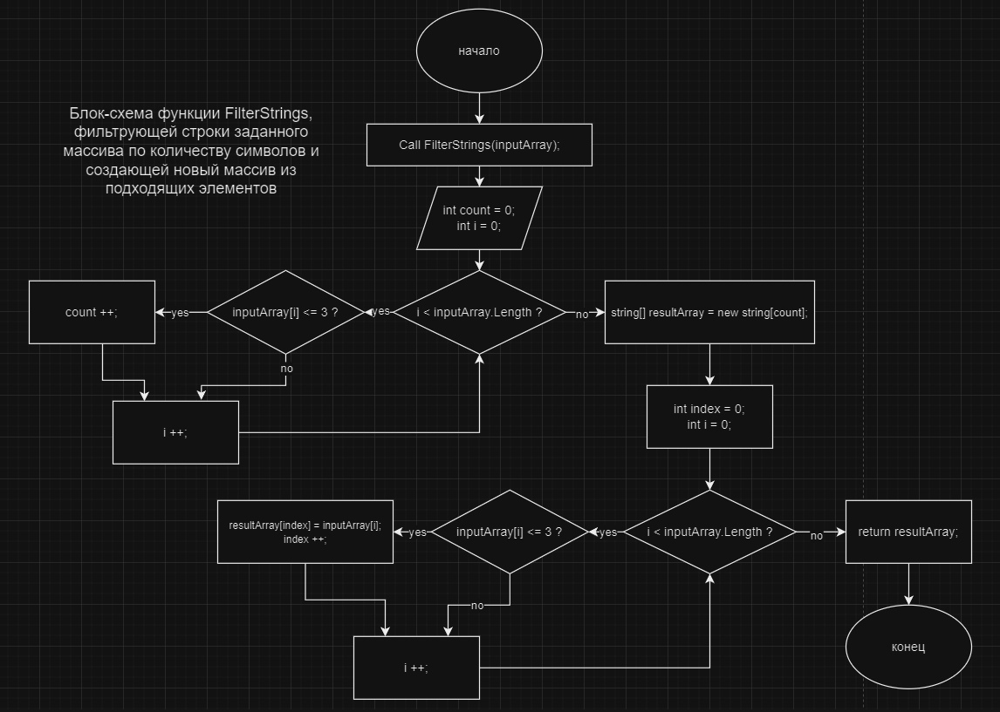

Программа начинается с чтения пользовательского ввода из консоли. Пользователю предлагается ввести строки, разделенные запятыми, которые сохраняются в массиве *inputArray*.

## 1. **Ввод данных**:
* Функция *Console.ReadLine()*
* Полученная строка разбивается на отдельные элементы с помощью *Split(',')*, создавая массив строк *inputArray*.

## 2. **Функция _FilterStrings_**:
Эта функция принимает *inputArray* в качестве аргумента и возвращает новый массив, содержащий только строки длиной 3 символа или меньше.
* __Шаг 1__: инициализация счетчика *count* равным нулю, чтобы подсчитать количество строк, удовлетворяющих условию.
* __Шаг 2__: Проход для каждого элемента в *inputArray*:
    * Проверка длины текущей строки ( *inputArray[i].Length <= 3* )
    * Если условие истинно, увеличиваем значение *count*
* __Шаг 3__: Создание нового массива *resultArray* с размером, равным значению *count*
* __Шаг 4__: Проход по *inputArray* еще раз:
    * Проверка длины текущей строки.
    * Если условие истинно, добавляем строку в *resultArray* по текущему индексу и увеличиваем индекс.

## 3. **Вызов функции _FilterStrings_**:
* После определения функции *FilterStrings*, вызываем ее с *inputArray* в качестве аргумента, результат сохраняется в *resultArray*.
## 4. **Вывод фильтрованного результата**:
* Вывод заголовка результата с помощью *Console.WriteLine("Результат:").
* Склеиваем элементы *resultArray* в одну строку с разделителем запятой, используя *string.Join(", ", resultArray)*, и выводим результат с помощью *Console.WriteLine*.